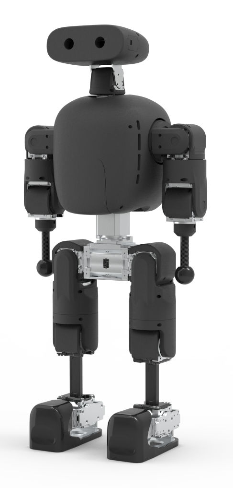
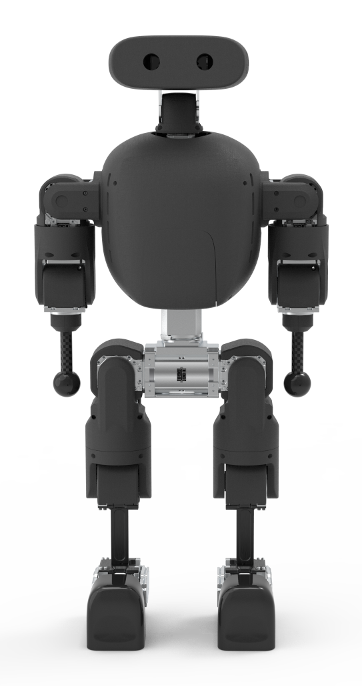

.. _robot-model_piplus:

HighTorque PiPlus
=================

    The PiPlus robot from HighTorque |br| (side view).

The `PiPlus <https://www.hightorque.cn/pi-plus/>`_ robot from `HighTorque <https://www.hightorque.cn>`_ is a 0.75 meter tall humanoid robot with 23 degrees of freedom and a wight of approximately 12.79kg.
It features **6 DoF per leg**, **4 DoF per arm**, **2 DoF for the head**, and **1 DoF for the waist**.

    The PiPlus robot from HighTorque |br| (front view).

The PiPlus robot model used in the simulation is based on the `official model files <https://github.com/HighTorque-Robotics/HT_URDF>`_ from HighTorque.
As a result, motions developed for the real robot should also work within the simulation and - with a bit of luck - vice versa.

|clearfloat|

.. _robot-model_piplus-properties:
    
Model Properties
----------------

+-------------------------+--------------------------------------------------------+
| Property                | Value                                                  |
+=========================+========================================================+
| Name / ID               | ``PiPlus``                                             |
+-------------------------+--------------------------------------------------------+
| Type / Anatomy          | Humanoid Robot                                         |
+-------------------------+--------------------------------------------------------+
| Height                  | 0.75 m                                                 |
+-------------------------+--------------------------------------------------------+
| Weight                  | 12.79 kg                                               |
+-------------------------+--------------------------------------------------------+
| DoF                     | 23 |mdash| 6 per leg, 4 per arm, 1 in waist, 2 in head |
+-------------------------+--------------------------------------------------------+
| Manufacturer / Team     | Guangzhou HighTorque Technology Co., Ltd.              |
+-------------------------+--------------------------------------------------------+

.. _robot-model_piplus-joints:

Joints
------

The PiPlus robot is equipped with the following joints:

+---------------------------+-----------+-----------------------------+
| Name                      | Axis      | Range (deg)                 |
+===========================+===========+=============================+
| head_yaw_joint            | (0, 0, 1) | -81.93 ... +81.93           |
+---------------------------+-----------+-----------------------------+
| head_pitch_joint          | (0, 1, 0) | -70.47 ... +57.87           |
+---------------------------+-----------+-----------------------------+
| waist_yaw_joint           | (0, 0, 1) | -153.55 ... +153.55         |
+---------------------------+-----------+-----------------------------+
| l_shoulder_pitch_joint    | (0, 1, 0) | -239.50 ... +59.59          |
+---------------------------+-----------+-----------------------------+
| l_shoulder_roll_joint     | (1, 0, 0) | -7.45 ... +179.91           |
+---------------------------+-----------+-----------------------------+
| l_upper_arm_joint         | (0, 0, 1) | -123.76 ... +123.76         |
+---------------------------+-----------+-----------------------------+
| l_elbow_joint             | (0, 1, 0) | -114.59 ... +114.59         |
+---------------------------+-----------+-----------------------------+
| r_shoulder_pitch_joint    | (0, 1, 0) | -239.50 ... +59.59          |
+---------------------------+-----------+-----------------------------+
| r_shoulder_roll_joint     | (1, 0, 0) | -179.91 ... +7.45           |
+---------------------------+-----------+-----------------------------+
| r_upper_arm_joint         | (0, 0, 1) | -123.76 ... +123.76         |
+---------------------------+-----------+-----------------------------+
| r_elbow_joint             | (0, 1, 0) | -114.59 ... +114.59         |
+---------------------------+-----------+-----------------------------+
| l_hip_pitch_joint         | (0, 1, 0) | -178.76 ... +168.45         |
+---------------------------+-----------+-----------------------------+
| l_hip_roll_joint          | (1, 0, 0) | -9.74 ... +179.91           |
+---------------------------+-----------+-----------------------------+
| l_thigh_joint             | (0, 0, 1) | -164.44 ... +164.44         |
+---------------------------+-----------+-----------------------------+
| l_calf_joint              | (0, 1, 0) | -122.61 ... +134.65         |
+---------------------------+-----------+-----------------------------+
| l_ankle_pitch_joint       | (0, 1, 0) | -55.58 ... +52.71           |
+---------------------------+-----------+-----------------------------+
| l_ankle_roll_joint        | (1, 0, 0) | -44.69 ... +44.69           |
+---------------------------+-----------+-----------------------------+
| r_hip_pitch_joint         | (0, 1, 0) | -178.76 ... +168.45         |
+---------------------------+-----------+-----------------------------+
| r_hip_roll_joint          | (1, 0, 0) | -179.91 ... +9.74           |
+---------------------------+-----------+-----------------------------+
| r_thigh_joint             | (0, 0, 1) | -164.44 ... +164.44         |
+---------------------------+-----------+-----------------------------+
| r_calf_joint              | (0, 1, 0) | -122.61 ... +134.65         |
+---------------------------+-----------+-----------------------------+
| r_ankle_pitch_joint       | (0, 1, 0) | -55.58 ... +52.71           |
+---------------------------+-----------+-----------------------------+
| r_ankle_roll_joint        | (1, 0, 0) | -44.69 ... +44.69           |
+---------------------------+-----------+-----------------------------+

State information for the above joints is received via a :ref:`Joint State Perceptor <agent-protocol_joint-state-perceptor>`.

Joint actions are performed using :ref:`Motor Effectors <agent-protocol_motor-effector>` for the respective joints.

.. _robot-model_piplus-sensors:

Sensors
-------

The PiPlus robot is equipped with the following sensors:

+---------------------------------------------------------------+------------+-----------------+-------------------+
| Perceptor                                                     | Name       | Frame / Body    | Position          |
+===============================================================+============+=================+===================+
| :ref:`Position <agent-protocol_position-perceptor>`           | torso_pos  | torso           | origin            |
+---------------------------------------------------------------+------------+-----------------+-------------------+
| :ref:`Orientation <agent-protocol_orientation-perceptor>`     | torso_quat | torso           | origin            |
+---------------------------------------------------------------+------------+-----------------+-------------------+
| :ref:`Gyro-Rate <agent-protocol_gyro-rate-perceptor>`         | torso_gyro | torso           | origin            |
+---------------------------------------------------------------+------------+-----------------+-------------------+
| :ref:`Accelerometer <agent-protocol_accelerometer-perceptor>` | torso_acc  | torso           | origin            |
+---------------------------------------------------------------+------------+-----------------+-------------------+
| :ref:`Ideal Vision <agent-protocol_vision-perceptor>`         | camera     | head_pitch_link | (0.05 0.005 0.06) |
+---------------------------------------------------------------+------------+-----------------+-------------------+
